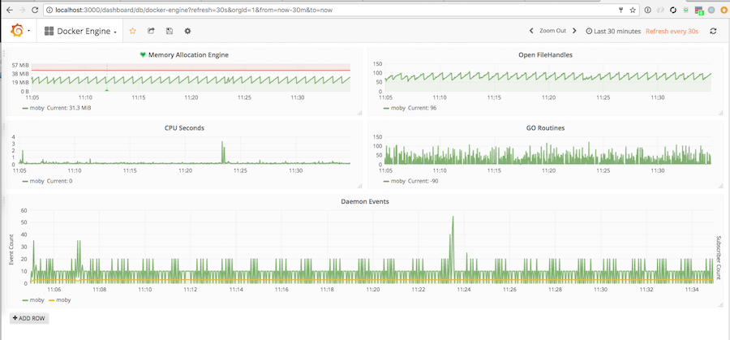

# docker-plugin-metrics-opentsdb
Docker metrics plugin to push metrics to OpenTSDB.

## Make

You can build the plugin locally using the `make.sh` file.

```bash
$ ./make.sh
+ name=qnib/docker-metrics-plugin-opentsdb
+ docker build -f Dockerfile.pluginbuild -t qnib/docker-metrics-plugin-opentsdb .
Sending build context to Docker daemon  6.986MB
*snip*
Removing intermediate container 5d57bef5b4c3
Successfully built 66d51ea5cc66
Successfully tagged qnib/docker-metrics-plugin-opentsdb:latest
++ docker create qnib/docker-metrics-plugin-opentsdb
+ id=700a898df4884e0f49d2f6335b6a1b2c30ade110a3c0184f3c241ebe2e94e343
+ rm -rf rootfs
+ mkdir -p rootfs
+ docker export 700a898df4884e0f49d2f6335b6a1b2c30ade110a3c0184f3c241ebe2e94e343
+ tar -xvf - -C rootfs
*snip*
+ docker rm 700a898df4884e0f49d2f6335b6a1b2c30ade110a3c0184f3c241ebe2e94e343
700a898df4884e0f49d2f6335b6a1b2c30ade110a3c0184f3c241ebe2e94e343
+ rm -rf rootfs/proc rootfs/sys rootfs/go rootfs/etc rootfs/dev
+ docker plugin create qnib/docker-metrics-plugin-opentsdb .
qnib/docker-metrics-plugin-opentsdb
```

Now it is created, but not yet enable.

```bash
$ docker plugin ls
ID                  NAME                                         DESCRIPTION                          ENABLED
24146ac07c50        qnib/docker-metrics-plugin-opentsdb:latest   Plugin to push metrics to OpenTSDB   false
```

### Install

The plugin can also be downloaded from hub:

```bash
$ docker plugin install --grant-all-permissions --disable qnib/docker-plugin-metrics-opentsdb
latest: Pulling from qnib/docker-plugin-metrics-opentsdb
aeafb985cbf2: Download complete
Digest: sha256:378ddf68f00d32205de61cbb620e496dae9e311e175c17f455cb36b9fe60c2f4
Status: Downloaded newer image for qnib/docker-plugin-metrics-opentsdb:latest
Installed plugin qnib/docker-plugin-metrics-opentsdb
$ docker plugin ls
ID                  NAME                                         DESCRIPTION                          ENABLED
9637644e8521        qnib/docker-plugin-metrics-opentsdb:latest   Plugin to push metrics to OpenTSDB   false
$
```

#### Local OpenTSDB stack

The plugin assumes to find an OpenTSDB (v1) endpoint at `localhost:4242`, to start one locally you can deploy the docker-compose file:

```bash
docker stack deploy --compose-file docker-compose.yml influxdb
Creating network influxdb_default
Creating service influxdb_backend
Creating service influxdb_frontend
```

#### Remote OpenTSDB stack

If you already have a stack, adjust the configuration to find it.

```bash
$ docker plugin set qnib/docker-metrics-plugin-opentsdb:latest OPENTSDB_HOST=127.0.0.1
$ docker plugin set qnib/docker-metrics-plugin-opentsdb:latest OPENTSDB_PORT=4242
```

### Enable

```bash
$ docker plugin enable qnib/docker-plugin-metrics-opentsdb
qnib/docker-plugin-metrics-opentsdb
```

Now the grafana4 dashboard (in case you deployed it locally: [localhost:3000/dashboard/db/docker-engine](http://localhost:3000/dashboard/db/docker-engine)) should show you the stats.


